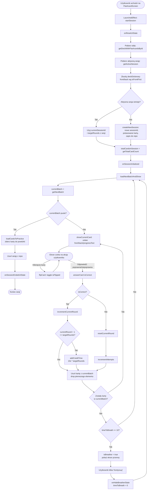

# PL - Passlingo

> Doomscrolling to czynność polegająca na spędzaniu nadmiernej ilości czasu na treściach cyfrowych (np. krótkie treści, treści generowane przez użytkowników, treści generowane przez sztuczną inteligencję i wiadomości), które wywołują negatywne emocje.

**Passlingo** to darmowa aplikacja o otwartym kodzie źródłowym, zaprojektowana, aby pomóc użytkownikom odzyskać kontrolę nad cyfrowymi nawykami, poprawić koncentrację i zwiększyć produktywność. Aplikacja łączy mechanizmy blokowania rozpraszaczy z systemem mikronauki. Zdobyty dzięki ograniczeniu doomscrollingu czas możesz przeznaczyć na naukę języków obcych, przyswajanie nowych pojęć czy przygotowanie do rozmowy rekrutacyjnej.

> [!WARNING]
> Aplikacja celowo narusza standardowe zasady ułatwień dostępu (Accessibility Services), aby móc monitorować i blokować wybrane przez użytkownika aplikacje. Passlingo posiada uprawnienia do wymuszania zamykania innych procesów w systemie.

>[!NOTE]
> Aplikacja została stworzona z myślą o systemie **Android** i obecnie nie wspiera innych systemów operacyjnych. W celu osiągnięcia najlepszych rezultatów zaleca się również korzystanie z dodatkowych wtyczek czy oprogramowań blokujących rozpraszające witryny i programy na komputerach osobistych.

## Instalacja i konfiguracja

Aby aplikacja mogła w pełni funkcjonować (szczególnie w zakresie weryfikacji odpowiedzi przez AI), konieczne jest wygenerowanie klucza API na platformie [Google AI Studio](https://aistudio.google.com/), a następnie umieszczenie go w pliku `local.properties`:
```
GEMINI_API_KEY=twój_klucz_api
```
Przy pierwszym uruchomieniu Passlingo użytkownik zostaje poproszony o przyznanie niezbędnych uprawnień systemowych:
* **Ułatwienia dostępu (Accessibility Services)** - wymagane do monitorowania i blokowania wybranych aplikacji.
* **Wyświetlanie nad innymi aplikacjami** - pozwala na nałożenie ekranu blokady.
* **Dane o korzystaniu z aplikacji** - niezbędne do śledzenia czasu spędzanego w innych aplikacjach.

## Prywatność i zapisywane dane

Passlingo priorytetowo traktuje Twoją prywatność. Wszystkie tworzone talie, informacje o zablokowanych aplikacjach oraz zgromadzony czas są zapisywane wyłącznie lokalnie na Twoim urządzeniu.

**Wyjątek**: w trybie nauki poprzez "pisanie", jeśli zdecydujesz się na odwołanie od błędu, dane takie jak: treść pytania, wzorcowa odpowiedź oraz odpowiedź użytkownika, są wysyłane do API Google Gemini w celu ponownej weryfikacji. Żadne inne dane nie opuszczają urządzenia użytkownika.

## System czasu

Główną mechaniką Passlingo jest zarządzanie wirtualną walutą, jaką jest czas. Posiadany czas pozwala na korzystanie z zablokowanych aplikacji lub na ich trwałe odblokowanie.

Czas można zdobywać na dwa sposoby:
1. **Poprzez naukę**: czas przyznawany jest za poprawne odpowiedzi po zakończeniu sesji nauki. Wartość ta zależy od wybranej liczby rund.
```
DOSTĘPNY CZAS = DOSTĘPNY CZAS + 10 SEKUND * LICZBA RUND
```
2. **Poprzez blokowanie aplikacji**: za każdą nowo zablokowaną aplikację otrzymujesz natychmiastowy bonus czasowy.
```
DOSTĘPNY CZAS = DOSTĘPNY CZAS + LICZBA NOWYCH APLIKACJI DO ZABLOKOWANIA * 15 MINUT
```

## Blokowanie / odblokowywanie aplikacji

Aby zablokować aplikację, kliknij ikonę kłódki na ekranie głównym, wybierz interesujące Cię pozycje i potwierdź wybór. Zablokowane aplikacje będą niedostępne, dopóki nie użyjesz zgromadzonego czasu na ich uruchomienie lub trwałe odblokowanie.

**Odblokowanie aplikacji**:

Trwałe odblokowanie aplikacji kosztuje określoną ilość zgromadzonego czasu. Jeśli nie posiadasz wystarczających środków, operacja będzie niemożliwa.
```
DOSTĘPNY CZAS = DOSTĘPNY CZAS - 1 GODZINA
```

>[!CAUTION]
>W sytuacjach absolutnie krytycznych możliwe jest ominięcie blokady poprzez wyczyszczenie danych aplikacji w ustawieniach systemu Android. **Niezalecane**, ponieważ niweczy to proces budowania zdrowych nawyków cyfrowych.

## Tworzenie i edycja talii (zestawów)

>[!IMPORTANT]
>Passlingo **nie zawiera** gotowych zestawów do nauki. Użytkownik musi samodzielnie tworzyć własne talie.

Aby utworzyć talię, należy podać jej tytuł oraz dodać minimum 4 karty. Możliwość zmiany ikony talii jest opcjonalna.

Passlingo obsługuje również **import kart** w przypadku większych zbiorów. Wymagany format pliku to: `pytanie [TAB] odpowiedź`. Inne formaty nie są obecnie obsługiwane.

Edycja talii (dodawanie / usuwanie kart) nie wpływa na bieżące sesje nauki. Możesz kontynuować naukę z uwzględnieniem nowo wprowadzonych zmian.

## Tryby nauki

Passlingo oferuje trzy tryby nauki. Można korzystać z nich naprzemiennie, jednakże **nie jest możliwe** posiadanie aktywnych sesji tego samego trybu z różnymi ustawieniami. Postęp nauki jest na bieżąco zapisywany, co pozwala na powrót do nauki w dowolnym momencie. Dodatkowo, każdy tryb posiada system przerw, który aktywuje się co 10 odpowiedzi (niezależnie od ich poprawności)

### Fiszki



### Quiz

System generuje pytanie oraz do 4 wariantów odpowiedzi (w zależności od ilości kart w talii i unikalności samych odpowiedzi). Błędne odpowiedzi (dystraktory) są dobierane tak, aby wizualnie lub znaczeniowo przypominały poprawną odpowiedź, zwiększając poziom trudności. Do wyliczenia podobieństwa wykorzystany jest *algorytm odległości Levenshteina*:

```kotlin
private fun levenshteinDistance(a: String, b: String): Int {
    val m = a.length
    val n = b.length
    var cost = IntArray(size = m + 1) { it }
    var newCost = IntArray(size = m + 1) { 0 }
    for (i in 1..n) {
        newCost[0] = i
        for (j in 1..m) {
            val match = if (a[j - 1] == b[i - 1]) 0 else 1
            val costReplace = cost[j - 1] + match
            val costInsert = cost[j] + 1
            val costDelete = newCost[j - 1] + 1
            newCost[j] = minOf(a = costInsert, b = costDelete, c = costReplace)
        }
        val swap = cost
        cost = newCost
        newCost = swap
    }
    return cost[m]
}
```



```mermaid
flowchart TD
    Start([Użytkownik wchodzi na QuizScreen]) --> Launch[LaunchedEffect: startSession]
    Launch --> Reset[onResetUiState]
    Reset --> GetDeck[Pobierz talię: getDeckWithFlashcardsById]
    GetDeck --> GetActive[Pobierz aktywną sesję: getActiveSession]
    GetActive --> BuildDict[Zbuduj deckDictionary
    front/back wg isFrontFirst]
 
    BuildDict --> HasActive{Aktywna sesja istnieje?}
    HasActive -- Tak --> UseExisting[Użyj currentSessionId
    i targetRounds z sesji]
    HasActive -- Nie --> CreateNew[createNewSession:
    nowe sessionId, potasowane karty,
    zapis do repo]
 
    UseExisting --> Total[totalCardsInSession = getTotalCardCount]
    CreateNew --> Total
    Total --> InitQuiz[onSessionInitialized override:
    allCards = getAllCards sessionId]
    InitQuiz --> LoadBatch[loadNextBatchAndShow]
 
    LoadBatch --> GetBatch[currentBatch = getNextBatch]
    GetBatch --> BatchEmpty{currentBatch puste?}
 
    BatchEmpty -- Tak --> Practice[loadCardsToPractice
    zbierz karty do powtórki]
    Practice --> DeleteSession[Usuń sesję z repo]
    DeleteSession --> SessionEnd[onSessionEndedUiState]
    SessionEnd --> End([Koniec sesji])
 
    BatchEmpty -- Nie --> ShowCard[showCurrentCard]
    ShowCard --> BuildOptions[Zbuduj opcje odpowiedzi:
    - correctAnswer z deckDictionary
    - allMeanings = unikalne tłumaczenia z allCards
    - allWrong = allMeanings bez poprawnej
    - jeśli allWrong > 3: posortuj wg
      odległości Levenshteina do correctAnswer
      i weź 3 najbliższe
    - options = wrongAnswers + correctAnswer, shuffled]
    BuildOptions --> UpdateUi[Zaktualizuj UI:
    currentFront, currentBack, options,
    userAnswer = NONE, progressText]
    UpdateUi --> WaitAction([Ekran czeka na wybór odpowiedzi])
 
    WaitAction -- Wybór opcji --> CheckAnswer[checkUserAnswer selectedText]
    CheckAnswer --> IsCorrectNow{selectedText
    == currentBack?}
    IsCorrectNow -- Tak --> PlayGoodSound[Odtwórz dźwięk:
    co 10 z rzędu -> ten_correct_music
    co 5 z rzędu -> five_correct_music
    w innym wypadku -> correct_music]
    IsCorrectNow -- Nie --> PlayBadSound[Odtwórz dźwięk: wrong_music]
    PlayGoodSound --> SetAnswered[userAnswer = GOOD
    selectedAnswer = wybór]
    PlayBadSound --> SetAnsweredBad[userAnswer = BAD
    selectedAnswer = wybór]
    SetAnswered --> ShowResult[UI podświetla poprawną/błędną
    odpowiedź, pokazuje przycisk 'Dalej']
    SetAnsweredBad --> ShowResult
 
    ShowResult --> WaitNext([Użytkownik klika 'Dalej'])
    WaitNext --> MoveNext[moveToNextCard]
 
    MoveNext --> IsGood{userAnswer == GOOD?}
    IsGood -- Tak --> IncPerfect[countPerfectAnswer++
    incrementCurrentRound]
    IncPerfect --> RoundsDone{currentRound + 1
    == targetRounds?}
    RoundsDone -- Tak --> AddCredit[addCreditTime
    10s * targetRounds]
    RoundsDone -- Nie --> IncBreath
    AddCredit --> IncBreath
 
    IsGood -- Nie --> ResetPerfect[countPerfectAnswer = 0
    resetCurrentRound
    incrementAttempts]
    ResetPerfect --> IncBreath[timeToBreath++]
 
    IncBreath --> DropCard[Usuń kartę z currentBatch
    drop pierwszego elementu]
    DropCard --> BatchLeft{Zostały karty
    w currentBatch?}
    BatchLeft -- Tak --> ShowCard
    BatchLeft -- Nie --> BreathCheck{timeToBreath >= 10?}
 
    BreathCheck -- Tak --> Breather[isBreather = true
    pokaż ekran przerwy]
    Breather --> Continue[Użytkownik klika 'Kontynuuj']
    Continue --> HideBreather[onHideBreatherState
    timeToBreath = 0]
    HideBreather --> LoadBatch
 
    BreathCheck -- Nie --> LoadBatch
```

### Pisanie

W tym trybie zadaniem użytkownika jest samodzielne wpisanie poprawnej odpowiedzi (wielkość liter i białe znaki są ignorowane).

Jeśli system uzna odpowiedź za błędną, możesz złożyć *odwołanie*. Wtedy Twoja odpowiedź, wraz z pytaniem i poprawną wersją, zostaje przesłana do weryfikacji przez model **Gemini 3.5 Flash Lite**. Sztuczna inteligencja może:
* Zaliczyć odpowiedź jako poprawną (np. inna forma słowa, synonim).
* Utrzymać błąd i podać powód, dla którego odpowiedź jest niepoprawna w 3 zdaniach.

Nawet po weryfikacji przez AI, użytkownik ma ostateczne prawo wyboru: może zgodzić się z werdyktem lub wymusić uznanie odpowiedzi za poprawną.

Karty, na które odpowiedziano błędnie, wracają do puli podczas sesji, ale ich późniejsze poprawne odgadnięcie nie wlicza do wyniku końcowego.

```mermaid
flowchart TD
    ShowCard[showCurrentCard:
    currentProgress = repeatCard ?: currentBatch.first] --> UpdateUi[Zaktualizuj UI:
    currentFront, currentBack, progressText]
    UpdateUi --> WaitInput([Użytkownik wpisuje odpowiedź
    i klika 'Sprawdź'])
 
    WaitInput --> CheckAnswer[checkUserAnswer userAnswer, correctAnswer]
    CheckAnswer --> Normalize[Normalizacja obu tekstów:
    trim + redukcja wielu spacji do jednej]
    Normalize --> Match{cleanUser == cleanCorrect
    ignoreCase?}
 
    Match -- Tak --> SoundGood[Dźwięk: co 10 z rzędu -> ten_correct_music
    co 5 z rzędu -> five_correct_music
    w innym wypadku -> correct_music]
    SoundGood --> SetGood[userAnswer = GOOD
    timeToBreath++]
    SetGood --> WaitGood([UI pokazuje przycisk 'Dalej'])
 
    Match -- Nie --> SoundBad[Dźwięk: wrong_music]
    SoundBad --> SetBad[userAnswer = BAD]
    SetBad --> RepeatCheck{repeatCard == null?}
    RepeatCheck -- Tak --> AssignRepeat[repeatCard = currentBatch.first]
    RepeatCheck -- Nie --> KeepRepeat[pozostaw istniejący repeatCard]
    AssignRepeat --> ShowBadUi
    KeepRepeat --> ShowBadUi[UI pokazuje poprawną odpowiedź
    + przyciski 'Sprawdź ponownie z AI' i 'Dalej']
 
    ShowBadUi --> BadChoice{Wybór użytkownika}
    BadChoice -- "Sprawdź ponownie z AI" --> AiFlow[[Weryfikacja AI — patrz diagram niżej]]
    BadChoice -- "Dalej (rezygnacja z AI)" --> MoveNext
 
    AiFlow -- AI/uznanie: odpowiedź uznana za poprawną --> WaitGood
    AiFlow -- AI odrzucił lub błąd sieci, dialog zamknięty --> ShowBadUi
 
    WaitGood --> MoveNext[moveToNextCard]
 
    MoveNext --> GuardAi{isAiChecking?}
    GuardAi -- Tak --> Abort([Przerwij — poczekaj na
    zakończenie zapytania do AI])
    GuardAi -- Nie --> GetProgress[currentProgress = repeatCard ?: currentBatch.first]
    GetProgress --> IsGoodNow{uiState.userAnswer == GOOD?}
 
    IsGoodNow -- Tak --> IncPerfect[countPerfectAnswer++]
    IncPerfect --> HadRepeat{repeatCard != null?
    czyli była wcześniej pomyłka}
    HadRepeat -- Tak --> ClearRepeat["repeatCard = null
    hasAiRejected = false, isAiChecking = false
    BRAK incrementCurrentRound i BRAK drop z batcha
    (runda została już zresetowana przy pomyłce,
    karta wraca do normalnego cyklu)"]
    HadRepeat -- Nie --> IncRound[incrementCurrentRound]
    IncRound --> RoundsDone{currentRound + 1
    == targetRounds?}
    RoundsDone -- Tak --> AddCredit[addCreditTime
    10s * targetRounds]
    RoundsDone -- Nie --> DropBatch
    AddCredit --> DropBatch[currentBatch = drop pierwszej karty]
 
    IsGoodNow -- Nie --> ResetPerfect[countPerfectAnswer = 0
    resetCurrentRound
    incrementAttempts]
    ResetPerfect --> DropIfFirst{currentBatch.first.id
    == currentProgress.id?}
    DropIfFirst -- Tak --> DropBatch2[currentBatch = drop pierwszej karty]
    DropIfFirst -- Nie --> NoDrop[nie usuwaj z batcha]
    DropBatch2 --> ResetUi
    NoDrop --> ResetUi
 
    ClearRepeat --> ResetUi["userAnswer = NONE
    wyczyść pole tekstowe (userAnswerState.clear)"]
    DropBatch --> ResetUi
 
    ResetUi --> NextDecision{currentBatch niepuste
    LUB repeatCard != null?}
    NextDecision -- Tak --> ShowCard
    NextDecision -- Nie --> BreathCheck{timeToBreath >= 10?}
    BreathCheck -- Tak --> Breather[isBreather = true]
    Breather --> Continue([Użytkownik klika 'Kontynuuj'])
    Continue --> HideBreather[onHideBreatherState
    timeToBreath = 0]
    HideBreather --> LoadBatch[loadNextBatchAndShow]
    BreathCheck -- Nie --> LoadBatch
```



## Wykorzystanie AI

Sztuczna inteligencja wspiera proces powstawania oraz działanie aplikacji Passlingo, jednak jej użycie jest ograniczone **wyłącznie** do dwóch ścliśle określonych obszarów:
* **Projektowanie interfejsu (UI/UX)** - koncept graficzny aplikacji oraz spójna paleta kolorów zostały wygenerowane przy pomocy narzędzi sztucznej inteligencji, co pozwoliło na zaprojektowanie nowoczesnego i przejrzystego środowiska wizualnego.
* **Weryfikacja wiedzy (JEDYNIE w trybie pisania)** - zintegrowany model Gemini funkcjonuje jako asystent weryfikujący. Należy podkreślić, że sztuczna inteligencja wewnątrz aplikacji działa **jedynie w tym** jednym przypadku - aktywuje się tylko i wyłącznie na wyraźne życzenie użytkownika, podczas odwołania od błędu w trybie pisania. Odpowiada wówczas za elastyczne sprawdzanie odpowiedzi (np. akceptację synonimów) oraz generowanie krótkich wyjaśnień. Żadne inne tryby nauki ani funkcje aplikacji nie przetwarzają Twoich danych przez AI.

## Plany przyszłościowe (Roadmap)

- [ ] Poprawa interfejsu (UI) i doświadczeń użytkownika (UX).
- [ ] Implementacja powiadomień o kończącym się czasie.
- [ ] Wprowadzenie lokalnych modeli uczenia maszynowego (Offline ML) jako mechanizmu zapasowego - automatyczne przełączenie na model lokalny w przypadku braku połączenia Wi-Fi lub błędu zewnętrznego API.
- [ ] Stworzenie wersji desktopowej.
- [ ] Wprowadzenie synchronizacji danych z serwerem.

## Wykorzystane źródła

* [Wikipedia, *Doomscrolling*, online: https://en.wikipedia.org/wiki/Doomscrolling [dostęp: 18.09.2026]](https://en.wikipedia.org/wiki/Doomscrolling)
* [*Flashcards-Plus A Strategy to Help Students Prepare for Three Types of Multiple-Choice Questions Commonly Found on Introductory Psychology Tests*, red. Drew C. Appleby, online: https://www.scribd.com/document/668833966/appleby13flashcard [dostęp: 12.07.2026]](https://www.scribd.com/document/668833966/appleby13flashcard)
* [*Reinventing Flashcards to Increase Student Learning*, red. Sawa Senzaki, Jana Hackathorn, Drew C. Appleby, Regan A. R. Gurung, online: https://journals.sagepub.com/doi/10.1177/1475725717719771 [dostęp: 12.07.2026]](https://journals.sagepub.com/doi/10.1177/1475725717719771)
* [*Expanding Retrieval Practice Promotes Short-Term Retention, but Equally Spaced Retrieval Enhances Long-Term Retention*, red. Jeffrey D. Karpicke, Henry Roediger, online: https://www.researchgate.net/publication/6261284_Expanding_Retrieval_Practice_Promotes_Short-Term_Retention_but_Equally_Spaced_Retrieval_Enhances_Long-Term_Retention [dostęp: 15.07.2026]](https://www.researchgate.net/publication/6261284_Expanding_Retrieval_Practice_Promotes_Short-Term_Retention_but_Equally_Spaced_Retrieval_Enhances_Long-Term_Retention)
* [*The Critical Importanceof Retrieval for Learning*, red. Jeffrey D. Karpicke, Henry Roediger, online: https://www.researchgate.net/publication/5574966_The_Critical_Importance_of_Retrieval_for_Learning [dostęp: 15.07.2026]](https://www.researchgate.net/publication/5574966_The_Critical_Importance_of_Retrieval_for_Learning)
* [Trip Gabriel and Matt Richtel, *GRANDING THE DIGITAL SCHOOL Inflating the Software Report Card*, online: https://www.nytimes.com/2011/10/09/technology/a-classroom-software-boom-but-mixed-results-despite-the-hype.html [dostęp: 17.07.2026]](https://www.nytimes.com/2011/10/09/technology/a-classroom-software-boom-but-mixed-results-despite-the-hype.html)
* [Wykorzystana czcionka *VAG Rounded*](https://online-fonts.com/fonts/vag-rounded)
* [Wykorzystane ikony *Chikin Variety Glyph Icons*](https://www.svgrepo.com/collection/chikin-variety-glyph-icons)
* [Wykorzystane dźwięki *Duolingo Soundboard*](https://www.myinstants.com/en/search/?name=duolingo)
* [roadmap.sh, *Prompt Engineering Roadmap*, online: https://roadmap.sh/prompt-engineering [dostęp: 16.09.2026]](https://roadmap.sh/prompt-engineering)
* [*Flutter vs Kotlin: Which one to choose for your project?*, red. Ilia Lotarev, online: https://adapty.io/blog/flutter-vs-kotlin [dostęp: 18.09.2026]](https://adapty.io/blog/flutter-vs-kotlin/)